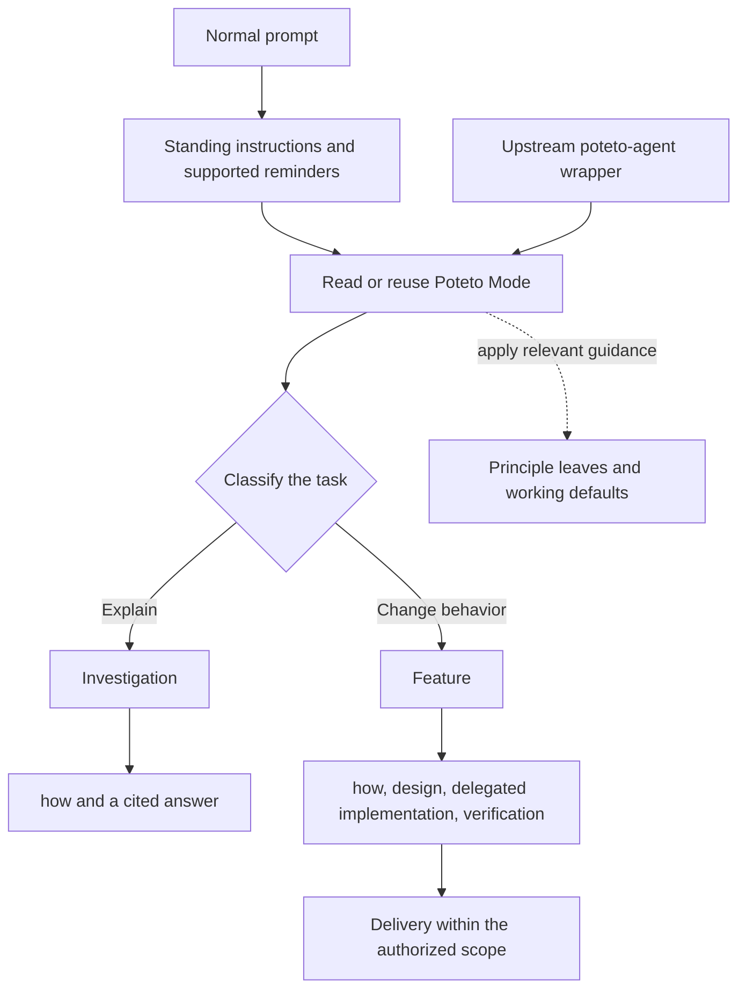

# Review 1: the router entry

Source review, 18 September 2026. This review proposes a clarification. It does not change PStack, BStack instructions, hooks, or skill activation.

Poteto Mode combines task classification, engineering policy, and workflow orchestration. The `poteto-agent` wrapper adds little separate logic. It directs the agent to read the router in full and reuse the same agent for the conversation. Those are instructions, not an executable persistence mechanism. [Wrapper](../engineering/agents/poteto-agent.md)

BStack now supplies another entry path through repository instructions and native reminder hooks. The hook names the router; the model still chooses the playbook, reads dependencies, and decides whether its existing context is sufficient. The recent CLI probes verify reminder delivery and selected routing behavior. They do not establish equivalent execution of every underlying workflow. [Project instructions](../../AGENTS.md), [CLI evidence](router-fallback.md)

The arrows after classification describe prompt instructions, not a deterministic execution engine.

## Where a small task goes

A simple explanation follows Investigation. It requires `how`, stays read-only, and explicitly excludes PRs and babysitting. The simple path inside `how` skips exploration agents but still requires one explainer agent. That is a deliberate cost of the current workflow. [Investigation](../engineering/skills/poteto-mode/playbooks/investigation.md), [how](../engineering/skills/how/SKILL.md)

A small feature follows the same Feature playbook as a larger behavior change. It requires grounding through `how`, architecture work or a recorded skip reason, implementation delegation, review, and verification. Delegated implementation is mandatory because the playbook values separation between author and reviewer. Commits and Opening a PR are later steps, still subject to the user's scope. [Feature](../engineering/skills/poteto-mode/playbooks/feature.md)

If `architect` runs, it asks for `how` again, then invokes `arena` for competing designs. There is no explicit contract saying that the preceding Feature grounding satisfies this request. This is a possible repeated-work path in the source. We have not measured whether an agent actually repeats it. [Architect](../engineering/skills/architect/SKILL.md)

## The first clarification worth testing

The selected playbook sometimes narrows a broad router rule.

| Router rule | Playbook qualification |
| --- | --- |
| Opening a PR runs at the end of every other playbook. | Investigation explicitly says no PR. |
| Code crossing a function boundary requires `architect`. | Feature permits an explicit architecture skip reason. |

These statements are in the [router](../engineering/skills/poteto-mode/SKILL.md), Investigation, and Feature. A model can infer that specific exceptions take precedence, but the source leaves that reconciliation implicit. The current BStack `AGENTS.md` already protects the user's scope and says to continue the active workflow. Those protections should remain authoritative.

The smallest proposed clarification is:

> Classify the task first. The selected playbook defines its required steps, permitted skips, and stopping point. Its explicit exceptions override generic workflow defaults. All steps remain bounded by the user's authorized scope and the host's higher-priority instructions.

This would preserve the existing workflow choices and make their precedence explicit. It would also give more weight to playbook exceptions, so each exception needs review before promoting the rule. This wording is a proposal only.

The next candidate is an explicit reuse rule for completed grounding. Existing findings could satisfy a dependency when they still cover the affected code and question. Changed code, new scope, or contradictory evidence would require another pass. That needs a separate test; a stale explanation must not silently become a permanent exemption.

## Context cost and consolidation

The router contains **18,677 characters**, including frontmatter. Its principle index accounts for **5,079**, and its playbook section accounts for **5,107**. Together they are 54.5% of the file. These are source character counts, not token counts or measured prompt cost.

The router asks for relevant principle leaves and the selected playbook. It does not require loading every skill. Merging all principles into four or five larger files could make a small task read more unrelated material. File count alone does not establish a context saving.

The CLI probes showed that the whole router can be read once and reused across the tested follow-ups. They did not measure repeated grounding inside full feature workflows, unnecessary delegation, or the cost of distributing instructions to delegates. Those are separate questions from reliable router activation.

## Recommendation and next decision

Keep the imported router as the control. Review precedence first, then compare the unchanged entry behavior with the proposed clarification using ordinary prompts. Include a read-only explanation, a planning-only request, a small code edit, and a substantial feature. Judge unnecessary steps as well as missed steps.

Allowing the main agent to handle simple questions or tiny edits directly would be a separate behavior change. It would reduce mandatory delegation, but give up the review separation PStack deliberately requires. That choice deserves its own discussion before consolidating skills.

The applied principles shaped this recommendation:

- [Laziness Protocol](../engineering/skills/principle-laziness-protocol/SKILL.md) kept the proposal to one precedence clarification and left the imported files intact.
- [Minimize Reader Load](../engineering/skills/principle-minimize-reader-load/SKILL.md) focused the review on how many places the model must reconcile to determine the next step.
- [Guard the Context Window](../engineering/skills/principle-guard-the-context-window/SKILL.md) kept consolidation conditional on the relevant material loaded, rather than the number of files.

`throughput checkpoint: n/a, read-only investigation`

This pass inspected source and existing evidence. It ran no new model experiments. Cursor-specific delegation tools and model names remain portability work; the available read-only review agent used here does not prove those runtime mappings.
