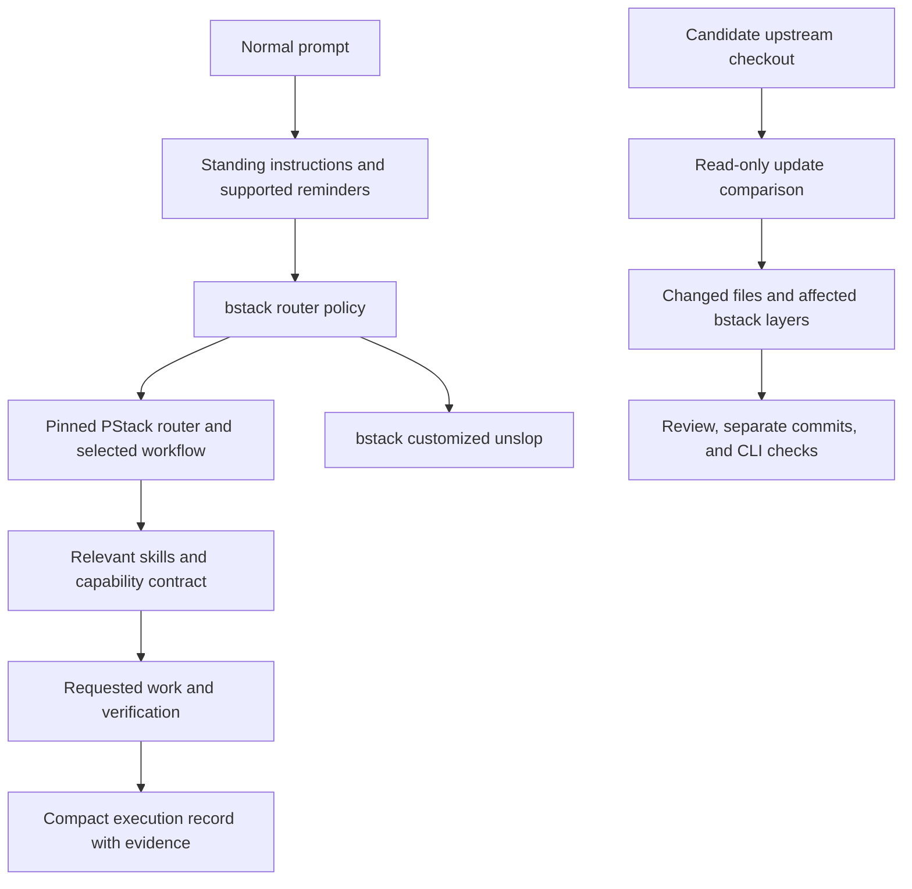

# bstack policy and upstream layers

Historical evidence predates the lowercase directory rename. Commands here use the current path; saved JSON evidence retains the original observed paths.

18 September 2026. This iteration preserves the pinned PStack workflows and moves bstack's changes into separately owned files. It does not consolidate the principle library or import Matt Pocock skills.

## Ownership

The 162 files under `engineering/` match their pinned upstream hashes and modes. The customized unslop was moved intact to `shared/skills/unslop/`; its two files match baseline commit `5b6f9aa` byte for byte. `pstack-provenance.json` now describes only upstream source. `layers.json` records the router policy, unslop replacement, origin, and upstream review bases. The update checker flags changed or removed dependencies and preserves all source and customization files during comparison.

The initial import and verified reminder POC are recorded in baseline commit `5b6f9aa`. The following implementation commit contains the layer separation and approved policy changes. The branch is `codex/bstack-layers`.

See [the update procedure](../UPSTREAM.md). Candidate comparison and hash checks are mechanical evidence. Semantic compatibility and adoption remain reviewed operations. A whole-skill replacement must receive desirable upstream improvements deliberately.

## Approved policy changes

- Keep figure-it-out for bespoke engineering plans, including one-time work. Ordinary prose selects no engineering workflow. Plan-only and read-only requests retain their scope.
- Use architecture exploration for consequential design uncertainty and risk. Reuse sufficient grounding instead of automatically repeating how.
- Resolve host, model, forge, tracker, chat, transcript, and control operations through available capabilities. Default delegation to inherit-parent. Preserve required independent-review distinctions.
- Continue authorized work without repeated permission questions. Deliver at the requested local or configured destination. Availability alone does not authorize external actions.
- Keep a short visible execution record. Distinguish reported, observed, and checked evidence, and preserve the deeper show-me-your-work and Eval audits.

These adjustments live in [the bstack entry](../shared/skills/bstack-router/SKILL.md) and its capability reference. The entry instructs delegates to apply that policy and resolves imported unslop references to the owned replacement. This is instruction layering, not an executable interception of every imported command.

## Verification scope

The maintainer suite tests import integrity, layer update behavior, hook protocols, installation migration, controlled policy classifications, resumed CLI turns, native compaction, and the Cursor/Grok after-tool fallback. Raw transcripts and prompts stay under gitignored `.bstack/verification/`. The accompanying [results](bstack-layers-results.json) record exact run locations and acceptance checks.

| CLI | Policy cases | Resumed routing turns | Native compaction | After-tool turns |
| --- | --- | --- | --- | --- |
| Codex | 10 passed | 3 passed | Passed | Not applicable |
| Claude Code | 10 passed | 3 passed | Passed | Not applicable |
| Cursor | 10 passed, including 3 focused reruns | 3 passed with prompt-hook limits | Not exercised | 4 passed |
| Grok | 10 passed | 3 passed with prompt-hook limits | Not exercised | 4 passed |

All four resumed sessions read the bstack entry on turn one only. Codex and Claude delivered fresh prompt receipts on all three turns. The 31 local tests passed, as did source/layer integrity, comparison with the unchanged pinned checkout, skill validation, and active documentation links.

The first policy run was stopped after discovering an underspecified response field and possible test-guide contamination. Its partial evidence is retained, not counted as acceptance. The revised suite excludes verification sources and expected-answer guides from content reads. A later focused Cursor rerun covers native read-only shell and host-local tool-schema formats that the first parser did not recognize. Those are harness corrections; the router policy was not changed to fit failing answers.

Classification passes do not prove that every imported workflow executes correctly. No real external provider adapter, work tracker, independent-review workflow, desktop app, or distributable plugin package was exercised here. The unchanged Cursor/Grok prompt-hook limits still apply. The policy layer adds instructions; no context reduction or deterministic routing is claimed.
