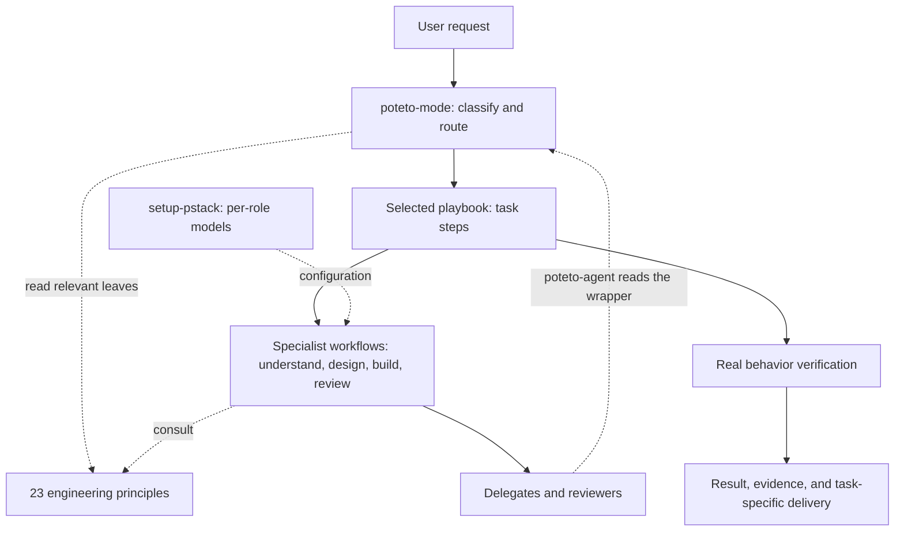
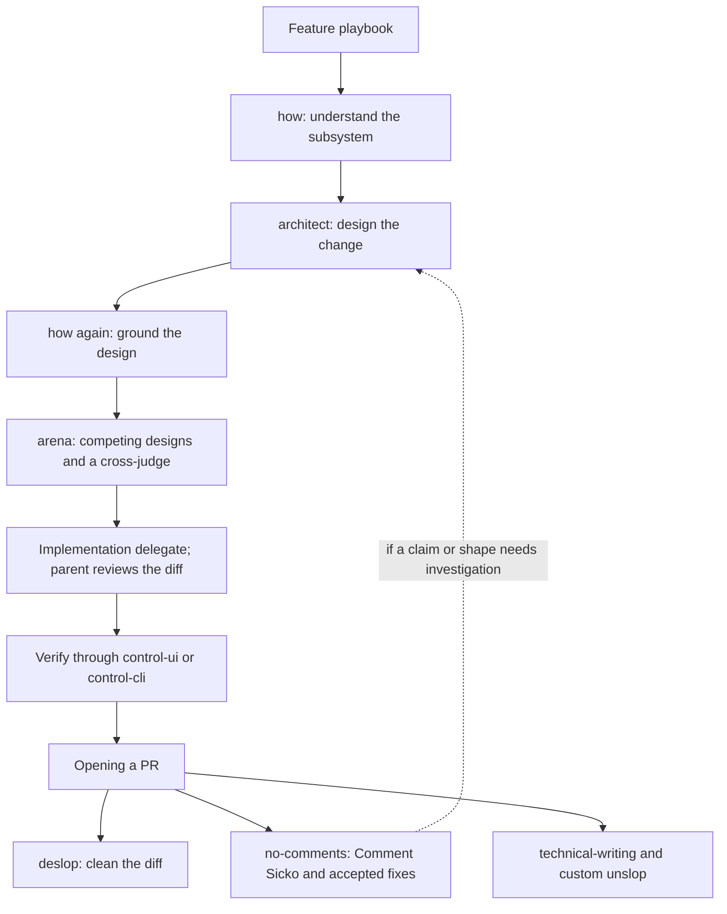

# How PStack works, and where bstack could simplify it

Source audit, 18 September 2026. Baseline: PStack 0.15.2, `cursor/plugins@e31650eea443aaea1e84cc15d88c13f40080b275`. This report describes the imported files. Recommendations are proposals; no consolidation or routing changes have been applied.

Historical snapshot: this audit predates the separate [bstack policy entry](../shared/skills/bstack-router/SKILL.md). The customized unslop has since moved to `shared/skills/unslop/`, and its upstream copy was restored. Current import counts and paths are in [the generated catalog](catalog.md); ownership and update rules are in [UPSTREAM.md](../UPSTREAM.md). The discussion below retains the original audit context.

## Read this first

PStack is a workflow system with a central router. `poteto-mode` classifies the task, selects a playbook, and brings in specialist skills and engineering principles. The principles describe how to make decisions; the playbooks prescribe how to execute a particular kind of work.

Its strongest ideas are worth preserving: understand the existing system, design around the data, isolate concurrent work, verify real behavior, and leave evidence another person can inspect. Its complexity comes from combining those ideas with a particular model roster, delegation policy, writing style, and GitHub delivery process.

The first simplification worth exploring is automatic access to a small common baseline, with specialist workflows loaded when needed. Merging principle files alone would leave the central routing and delegation costs largely intact. A five-family grouping looks plausible, but a performance or consistency improvement has not been demonstrated.

## What is installed

| Part | Count | Notes |
| --- | ---: | --- |
| PStack workflow and utility skills | 24 | Includes the router and model setup |
| PStack principle skills | 23 | Selected from the router's inline index |
| Companion skills | 3 | `deslop`, `control-cli`, `control-ui` from Cursor Team Kit |
| Playbooks | 23 | Files under `poteto-mode`, not separate registered skills |
| Agent definitions | 2 | `poteto-agent` and Comment Sicko |
| Dormant Benny skills | 3 | Separate automation sources, outside the manifest's `skills/` directory |
| Imported files | 163 | Includes guides, images, scripts, tests, licenses, and metadata |

The complete upstream PStack directory is present. The only replacement is `skills/unslop/SKILL.md`; its `agents/openai.yaml` is also copied from `code-maverick`. Both match that checkout byte for byte. Three companion skill directories and their license are added because PStack directly names them.

The original Cursor manifest remains named `pstack`. This is a source installation under bstack, not a claim that a native bstack plugin is already registered or works across all clients. No automations were activated and no global configuration was changed.

## The main flow

Arrows describe source-level routing. They are not an execution trace. The return from `poteto-agent` represents reloading the same instructions in a delegate, not proof of an infinite loop. Read-only investigation and forensics end with an answer; code-changing playbooks commonly route through Opening a PR.

The implementation has five layers:

| Layer | Owns | Where it lives |
| --- | --- | --- |
| Entry and policy | Triggers, principles index, autonomy, delegation defaults, reply style | [poteto-mode](../engineering/skills/poteto-mode/SKILL.md) |
| Task procedure | Ordered actions and the task's output contract | [playbooks](../engineering/skills/poteto-mode/playbooks/) |
| Specialized work | Investigation, alternative designs, review, verification, writing | [skills](../engineering/skills/) |
| Execution roles | A delegate that reloads the mode; a comment-review specialist | [agents](../engineering/agents/) |
| Mechanical support | Plan validation, PR watching, orchestration records, decision logs | [mode scripts](../engineering/skills/poteto-mode/scripts/), [log helper](../engineering/skills/show-me-your-work/scripts/log.sh) |

## A feature shows how the dependencies accumulate

[Feature](../engineering/skills/poteto-mode/playbooks/feature.md) calls `how`, then `architect`. [Architect](../engineering/skills/architect/SKILL.md) calls `how` again unless the task is genuinely greenfield, then delegates competing designs to [arena](../engineering/skills/arena/SKILL.md). Each invocation may be useful, but there is no explicit reuse contract saying that the first `how` result satisfies the second call.

Architect's default roster has four candidate models. Arena adds one cross-judge. Even `how`'s simple path uses a separate explainer; its complex path uses two to four explorers plus an explainer. The feature workflow then requires delegated implementation, with its own fallback when nested delegation is unavailable. These are source-prescribed operations, not a measured count of agents from a real run.

[No-comments](../engineering/skills/no-comments/SKILL.md) is more than a prose cleanup. It invokes [Comment Sicko](../engineering/agents/comment-sicko.md), may call `how` or `why` to investigate comments, and can route accepted findings through `architect` and implementation. That is a potentially substantial workflow nested inside pre-review cleanup.

The [multi-phase plan](../engineering/skills/poteto-mode/playbooks/multi-phase-plan.md) adds another scale of machinery: ten live verification lanes per PR, plus gates, performance, and evidence review. Its [validator](../engineering/skills/poteto-mode/scripts/check-plan.mjs) checks fixed wording, lane count, and a specific model string. This provides repeatable structure while coupling that structure to one execution policy.

## What the dependencies buy, and what they cost

| Dependency | Useful separation | Cost or uncertainty | First candidate improvement |
| --- | --- | --- | --- |
| Router to playbook | Common task classification | A broad entry file and manual activation gate | Thin automatic router with explicit task boundaries |
| Principle index to leaf files | Details load selectively | Multiple reads, repeated rules, obligation to name applied principles | Compact common baseline plus focused references |
| Feature to `how` to architect to `how` | Ground design in real code | Repeated investigation unless the model chooses to reuse it | Pass a named grounding artifact with freshness conditions |
| Architect to arena | Real alternatives, independent comparison | Multiple models even when one established pattern may suffice | Escalate based on uncertainty and consequence |
| No-comments to investigation and architecture | Comments can expose real design problems | Cleanup can grow into a design task | Separate reporting from fixes that alter structure |
| `why` to multiple evidence sources | Avoid inventing historical rationale | Broad search, multiple delegates, external service assumptions | Narrow first; expand when the evidence does not answer the question |
| Writing to technical-writing plus unslop | Document structure and human voice | Overlapping sentence rules and a large combined read | Shared concise rules with optional document-specific detail |
| Orchestration to scripts | Mechanical state and repeatable checks | Host-specific schedules, paths, models, and publishing policy | Preserve mechanics; adapt policy and capability discovery |

The dependency itself is not the defect. Reusing one good verification contract is valuable. The strongest simplification targets are repeated grounding, unconditional orchestration, overlapping rules, and implicit assumptions about the host.

## Automatic activation is a separate design problem

Upstream sets `disable-model-invocation: true` on 46 of 47 top-level skills. Only `setup-pstack` lacks that flag. The imported custom `unslop` also lacks it, leaving 45 of 47 PStack skills manual-only. The three companion skills allow normal discovery.

Claude Code documents that this flag removes a skill's description from model context and prevents model invocation. Cursor documents explicit invocation for the same flag. That means a description such as “must always apply” does not override the loader's metadata. A mode asking to invoke another manual-only skill is also a portability concern; automatic composition must be verified on each host. These are documented semantics and source findings, not observed failures in a desktop session. [Claude Code skills](https://code.claude.com/docs/en/skills#control-who-invokes-a-skill), [Cursor skills](https://cursor.com/docs/skills)

The wrapper additionally uses Cursor fields such as `mode` and `reminder`. A persistent mode in one client does not establish persistent behavior in another. Codex uses progressive skill loading, but the imported Cursor metadata and subagent definitions still need an explicit compatibility pass. [OpenAI skill documentation](https://developers.openai.com/codex/skills/)

Three possible approaches deserve comparison:

| Approach | Benefit | Tradeoff |
| --- | --- | --- |
| Keep manual mode | Clear user intent; little accidental process | User must remember to enter it; current dependency assumptions remain |
| Enable discovery on every skill | Small installation change; direct matching | Many overlapping triggers; expensive workflows may activate too broadly |
| Small always-loaded baseline plus selective workflows | Ordinary prompts can receive the relevant discipline | Requires host adapters, clear boundaries, and activation tests |

The third is the best candidate for bstack. It has not been implemented. The baseline should describe a small set of common engineering expectations; the workflow descriptions should decide when investigation, alternatives, TDD, or review earn their cost. A slash command can remain available for an explicit deeper pass.

Automatic relevance must remain separate from authorization. Detecting that shipping or a long autonomous run might help should not itself start publishing or an unattended program. The user's current scope remains the boundary. Future Wayfinder routing belongs in this layer too, after we select Matt's skills.

## Context cost: what we can measure now

These are exact character counts from the imported files, including frontmatter. They are not tokenizer counts, actual prompt sizes, latency measurements, or claims that all these files load together.

| Read set | Characters | Interpretation |
| --- | ---: | --- |
| Mode entry file | 18,677 | Before its selected playbook and leaf files |
| All 23 principle files | 40,139 | An upper inventory total; the mode asks for relevant leaves |
| Example feature/design set | 42,557 | Mode, feature, how, architect, arena, custom unslop; excludes leaf principles and supporting prompts |
| Technical-writing plus custom unslop | 19,124 | A common writing combination |
| All 50 skills in the manifest directory | 184,202 | Disk content, not a startup context bill |

Progressive loading already avoids loading the whole corpus. Reducing 23 files to five is therefore not automatically a token saving. If each of five files contains a large set of unrelated instructions, the new system could load more material per task.

Under Claude Code's documented manual-only semantics, the upstream principle descriptions are already absent from the initial catalog. Consolidating them cannot be credited with a startup-catalog saving in that configuration. Any gain would have to come from smaller relevant read sets, fewer redundant reads, or less repeated instruction across delegates.

The model's initial catalog, loaded bodies, reference reads, inherited context, and repeated loading across delegates are separate costs. We should measure them separately. No claim about better consistency or context efficiency is justified by file count alone.

## A possible five-family grouping

This is a review lens, not five new skills. Every current principle is assigned once below; some naturally relate to another family too.

| Family | Current principles | Detail to preserve |
| --- | --- | --- |
| Model the system | Foundational thinking; model the domain; type-system discipline; boundary discipline; redesign from first principles | Domain ownership, impossible states, external validation, and the difference between redesigning and making a small patch |
| Reduce complexity | Laziness protocol; subtract before adding; minimize reader load; migrate callers then delete legacy APIs | External compatibility exceptions and the need to migrate every caller |
| Prove and learn | Prove it works; fix root causes; test behavior; attack the premise; encode lessons in structure | Real evidence, meaningful tests, questioning failed assumptions, and choosing enforcement over more prompt text |
| Deliver useful increments | Experience first; exhaust the design space; sequence verifiable units; outcome-oriented execution | When alternatives are useful; explicit boundaries for temporary breakage; verified user outcomes |
| Coordinate execution | Guard context; never block on the human; build the lever; idempotent operations; separate shared state | User direction, retries, ownership, concurrency controls, and whether tooling or delegation actually earns its cost |

Some apparent overlap contains an important distinction. Idempotence governs retries; isolation governs concurrent writers. Root-cause work traces a mechanism; questioning the premise revisits the framing. We should simplify the common phrasing while retaining these distinctions in references.

Potential rule conflicts need review before automatic loading. The mode's autonomy section permits team-chat actions without asking, while the never-block principle treats external messages as requiring confirmation. Outcome-oriented execution allows planned intermediate breakage, while sequence-verifiable-units asks for a green check between units. These can be reconciled through authorization and clearly defined verification boundaries; leaving the interpretation implicit makes behavior less predictable.

## Portability work exposed by the audit

| Assumption in the source | Examples | Consequence for bstack |
| --- | --- | --- |
| Cursor tool schema and model names | `Task`, `generalPurpose`, `environment: cloud`, per-role slugs | Translate roles and discover actual capabilities |
| Cursor settings and transcripts | `~/.cursor/rules/pstack-models.mdc`, `agent-transcripts/` | Use host-specific configuration and context readers |
| Cursor built-ins | `create-skill`, `/loop`, `/goal`, Grok Bot routines | Declare capabilities and provide a supported route where absent |
| Upstream repository layout | `pstack/skills/...`, `git show origin/main:pstack/...` | Resolve installed paths; avoid assuming upstream files exist on the consumer's trunk |
| GitHub-oriented delivery | Ready PRs, `gh`, stack mechanics; optional Origin | Keep local engineering usable without a forge |
| Platform-specific tools | macOS simulator cleanup; browser/CDP; PTY tools | Capability-dependent features, not universal guarantees |
| Nonportable skill names | `Poteto Mode`, `Make Bot UI` in frontmatter | Preserve the baseline now; normalize names in reviewed adapters |
| Package-cache writes | CLI bootstrap installs Bun dependencies beside the skill | Separate writable runtime state from a managed plugin bundle |
| Installation scope | ai-tools already has root skills; Benny lives outside PStack's manifest skill directory | Test bstack-only exports and ensure a Skills CLI install includes only the intended components |

The companion `verify-this` mentioned by control-ui is an optional context/example reference, not a required step in that control skill. It was not imported. Benny is preserved as dormant automation source and needs Slack, tracker, and control integration before use. Its own draft-PR policy differs from the main ready-PR policy, so it should remain scoped to its automation workflow.

## What has and has not been verified

The static checker verifies every imported file's hash and permissions against the provenance manifest. The requested unslop override and the three companion skills are explicitly recorded. YAML frontmatter, concrete relative Markdown links, the inventory totals, and report links were checked during this audit.

The reference scanner records code-span names, bold skill names, principle names, playbook paths, and relative Markdown links with file and line evidence. The resulting graph includes examples and optional references, and misses unmarked prose and dynamically discovered tools. Its edge count is not a count of runtime calls. A single unresolved Markdown link target, `url`, is an example placeholder in `why/references/synthesizer-prompt.md` rather than a missing installed file.

No headless agent eval, desktop behavior test, live publishing flow, or Benny automation was run. Upstream script test suites were not run; their source was imported without implementation changes. This pass establishes a reproducible baseline and an architectural reading.

## The next small decision

Review only the entry behavior next: what should apply to an ordinary engineering prompt, what should load conditionally, and what should remain a deliberate user request. Keep the current import as the control.

Then draft a small alternate entry layer without changing the underlying workflows. Compare ordinary feature, bug, explanation, planning-only, writing, and trivial-edit prompts across fresh sessions. Include both missed activations and unnecessary activations. Read the transcripts and resulting artifacts; record cost, tool calls, and context reads. Repeat cases rather than treating one success as reliability.

Only after that comparison should we merge principle content. Scriptable invariants can be deterministic. Skill selection and judgment can be made more reliable and observable, but a prompt-only routing system does not guarantee deterministic behavior.

Use the [catalog](catalog.md) for the later one-by-one review. The complete [static inventory](pstack-inventory.json) and [provenance](../pstack-provenance.json) keep this first pass reproducible.
