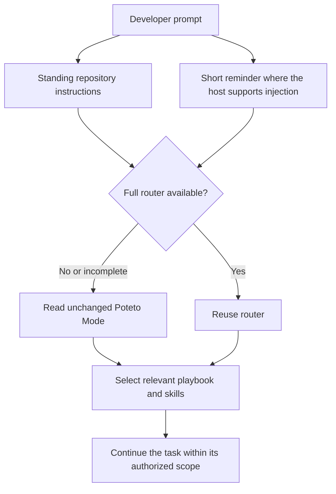

# bstack router POC

Historical evidence predates the lowercase directory rename. Commands here use the current path; saved JSON evidence retains the original observed paths.

Measured on September 18, 2026. The maintainer verification command discovered all four installed CLIs and passed 12 routing checks. Each client read the full Poteto Mode router on its first turn and reused it for two follow-ups. The router source is unchanged.

This supports the small-reminder design. Native hook delivery still differs between clients, so this is not a universal per-prompt guarantee.

## Results

| CLI | Version | Routing and same-session resume | Fresh prompt reminder | Router file reads | Native compaction |
|---|---|---|---|---|---|
| Codex | 0.153.2 | 3/3 passed | 3/3 receipts matched | Turn 1 only | Passed, including compact receipt delivery |
| Claude Code | 2.1.261 | 3/3 passed | 3/3 receipts matched | Turn 1 only | Passed, including compact-hook emission and next-turn recovery |
| Cursor | 2026.09.15-d2fe57e | 3/3 passed | Unsupported at prompt hook; session receipt matched | Turn 1 only | Not exercised |
| Grok | 1.0.34 | 3/3 passed | Unsupported at prompt hook; standing instructions used | Turn 1 only | Not exercised |

Codex and Claude reread the router after native compaction. The Codex continuation echoed both the prompt receipt and the compact receipt. Claude's check observed the native compaction boundary and compact-hook emission, then verified a fresh prompt receipt and correct routing in the same resumed session.

The production reminder is 323 characters with this checkout's absolute path. Verification adds a random receipt, making it 394 characters. The router is 18,677 characters. These are character counts, not tokenizer measurements. The hook sends only the reminder; the model decides whether it needs to reread the router.

## Installed pieces



- [AGENTS.md](../../AGENTS.md) points to the router. `CLAUDE.md` links to that same file. Cursor has an always-applied rule derived from the shared reminder.
- [The hook](../shared/router/hook.py) handles native Codex and Claude prompt/session events and Cursor session-start context. It does not inspect transcripts or inject the full router. Normal use writes no logs.
- [The installer](../shared/router/install.py) checks or installs repository adapters while preserving unrelated configuration. Codex's three hooks were reviewed through its native `/hooks` trust UI. The final verifier does not bypass that trust.
- [The verification skill](../shared/skills/verify-bstack/SKILL.md) is for bstack maintainers validating changes. Its feature map covers CLI discovery, routing, selective loading, resume, and context recovery.

## Run it

```bash
python3 bstack/shared/skills/verify-bstack/scripts/verify.py doctor
python3 bstack/shared/skills/verify-bstack/scripts/verify.py live
```

The default command detects `codex`, `claude`, `cursor-agent` or `agent`, and `grok` on PATH. It tests every installed supported CLI. Missing clients are reported as skipped. An explicitly requested missing client is blocked. Use `--tools codex claude` for focused testing.

Live runs send the test prompts and instruction files read by the agent to each signed-in provider. They use model usage. Codex uses Astra at medium effort; the other clients use their defaults. Each test is bounded, requests read-only classification, and resumes its own disposable session. The three cases cover bug fixes, measured performance regressions, and read-only investigations.

`pass_with_limits` preserves a successful routing result on Cursor or Grok while explicitly recording unavailable prompt-hook injection. A zero exit code can include this status. It does not mean universal hook parity.

## What the evidence establishes

The model echoed a random current-event receipt without reading evidence files. That distinguishes delivered context from a hook that merely executed. Saved read-tool calls independently show router loading. A router-specific fact and the selected playbook were checked on every turn, including turns without a router reread.

These are controlled probes. They establish the tested behavior, not deterministic compliance on every future task, every imported skill, or every model. The suite does not yet test continuous interactive terminal sessions, mid-turn automatic compaction, or subagent delivery. Desktop apps are deferred at the user's request.

## Compatibility findings

Cursor's prompt hook cannot add context. Its session hook delivered the reminder in the live test, and its standing rule remains the ongoing instruction path. No fresh prompt-hook receipt appeared on resumed turns. See [Cursor's hook reference](https://cursor.com/docs/hooks).

Grok's documented `UserPromptSubmit` implementation discards additional context. Its `AGENTS.md` path passed the routing tests. Grok also scans other clients' configuration and emitted parser warnings for valid Cursor hooks. The shared script recognizes Grok's documented `GROK_HOOK_EVENT` runner marker and returns an empty result when Grok invokes the Claude adapter, avoiding false receipts and evidence-write errors. Full hook compatibility remains unproven. See [Grok's hook reference](https://github.com/xai-org/grok-build/blob/main/crates/codegen/xai-grok-pager/docs/user-guide/10-hooks.md).

Two test-driver issues were resolved. Ignoring Codex user configuration prevented project-hook discovery. Closing the Codex app-server immediately after compaction prevented the pending compact hook from firing before the next model request. The corrected driver keeps that process alive through continuation, matching [Codex's documented lifecycle](https://developers.openai.com/codex/hooks). Earlier incomplete runs remain in local evidence.

## Evidence and checks

- [Portable results summary](router-poc-results.json).
- [Four-client discovery run](../../.bstack/verification/20260918T183759Z-ee842e/report.json).
- [Codex native compaction](../../.bstack/verification/20260918T181758Z-85ccaa/codex/native-compaction-d0341d/report.json).
- [Claude native compaction](../../.bstack/verification/20260918T181432Z-2152ec/claude/native-compaction/report.json).
- [Grok compatibility follow-up](../../.bstack/verification/20260918T183759Z-ee842e/grok/compat-followup-v3/report.json). Routing passed with no bstack hook error; the upstream Cursor-format parser warning remained.
- Four hook protocol tests passed. Adapter installation is idempotent. Skill validation passed. The import audit confirmed all 163 source files still match pinned hashes and permissions.

Detailed prompts, outputs, receipts, commands, exit codes, and failed attempts stay in gitignored `.bstack/verification/`. The source audit and this summary are distributable documentation. The whole bstack plugin packaging remains a later step.
