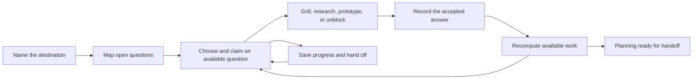

# Wayfinder in a local workspace

Status: draft for review. This describes the first local-app flow. It does not activate a skill, create a database, or select an application framework.

The [integration review](integration-review.md) records the agreed requirements. [Pinned Wayfinder](../upstream/matt-pocock/sdlc/skills/wayfinder/SKILL.md) supplies the starting workflow. Product behavior proposed below remains open to review.

## One planning effort, continued across sessions

A developer starts with an idea. Wayfinder helps establish the destination, identify open questions, and work through them. The local app shows what is known, what can be tackled now, and what still needs an answer. Closing the agent or restarting the machine preserves that work.

The first version should complete this loop:

The recommended first UI is a local browser app. Discussion stays in the user's existing agent chat; the app shows the map and supports direct edits. An agent can perform the same work with the browser closed. This chat boundary is a product recommendation awaiting the user's answer.

## Agreed constraints

- Work is local first and gitignored. An external tracker, Git host, or cloud account is not required to manage it.
- Product and ADR decisions belong to the user unless explicitly delegated. Automatic router activation does not delegate decision authority.
- An authorized autonomous grilling session uses two agents on different configured models. Required roles are checked before the run starts. Ordinary human-guided work does not require them.
- Prototype work follows the [approved prototype lifecycle](../engineering/prototype/WORKFLOW.md). Refinement remains prototyping until the user settles the direction. A design choice does not automatically create an ADR.
- The agent carries existing scope, decisions, and authorization across phases. The user should not have to coordinate different source skill packages.
- Fresh sessions receive a bounded handoff and relevant artifact references. A session summary alone cannot replace missing workflow instructions.

## The map describes decisions and dependencies

Use **map** for one planning effort and **question** for an item that advances it. Reserve **implementation ticket** for the later build work. These are proposed UI terms to avoid two meanings of "ticket."

A question has one of Wayfinder's four methods: grilling, research, prototype, or prerequisite task. A prerequisite task earns its place by enabling a decision, such as obtaining access to inspect an API. It does not authorize building the final product.

The map is a dependency graph. One question can depend on several answers, and one answer can unblock several questions. Topic groups and a tree-like view can make that graph readable without changing those relationships. Candidate answers can stay inside a question; the first version does not need a separate branching scenario engine.

The map summary includes its destination, current scope, unresolved areas that cannot yet be phrased as questions, and brief references to accepted answers. It also shows what was ruled out of scope. Full research findings and conversations load only when opened.

An available question is open, has all required answers, has no unresolved user or external wait, and has no active owner. In the UI, call this **Ready next**. This corresponds to the upstream "frontier." A user's explicit resumption can supply the awaited answer; an expired claim cannot clear that wait.

## Proposed local records

Keep a single local store shared by the agent operations and UI. SQLite is the recommended starting point. Its location belongs under gitignored `.bstack/`, separate from `.bstack/package/`, so package updates and removal preserve the developer's work.

The records need these responsibilities before a schema is chosen:

| Record | What it owns |
| --- | --- |
| Map | Stable identity, title, destination, scope, unresolved areas, progress, and links to its questions. |
| Question | The question, method, dependency links, priority, lifecycle, current progress, and relevant artifact references. |
| Resolution | Accepted answer or finding, who decided, whether authority was delegated, supporting references, and the revision it answers. |
| Claim | Which agent session is working on a question, its workspace, and whether that ownership is still active. A human user can have several sessions. |
| Handoff | The next session's goal, current item and phase, progress, decision authority, references, and next action. |

Domain terms and ADRs remain linkable artifacts. We still need to decide how their final forms are exported or retained. This first pass does not move existing repository ADRs into an ignored database or duplicate their bodies there.

One configured workspace must own the store for a repository's collaborating sessions, including worktrees. A worktree must not silently create an independent backlog. Separate clones remain separate local workspaces unless explicitly connected. How the installer locates that shared workspace is an implementation design step.

## Progress and ownership have different meanings

A question is open, resolved, needs review, or out of scope. Readiness follows from its dependencies. An active claim or a wait for a user answer describes what is happening to an open question; neither counts as resolution.

Claims must be acquired through one atomic operation. If two agents choose the same question, only one acquires it. The other refreshes available work. Retried writes must not create another question or resolution, and stale edits must report a conflict rather than overwrite newer work.

A paused or disconnected session leaves its progress intact. A claim can expire, but expiration does not mean the question is resolved. A resumed old owner must revalidate ownership before writing. Claim duration, renewal, and recovery mechanics belong in the implementation design.

Resolving a question records its accepted answer and updates its lifecycle together. A declined option or an out-of-scope question does not automatically satisfy a dependency. If that prerequisite is no longer needed, the dependency must be explicitly revised.

Changing an accepted answer preserves the earlier revision. Dependent work that relied on it is held for review before continuing; completed answers are not silently rewritten. This matters when engineering uncovers evidence that changes a planning assumption.

## Agent operations and the first visible flow

Use one set of operations for the UI and agents. A local CLI with structured responses is the recommended first agent adapter. An MCP adapter can call the same operations later. These are conceptual operations, not commands that exist today.

1. **Start or resume a map.** Find an existing effort by identity or title before creating another. Return its small summary, Ready next questions, active claims, and waits. Creating a map needs a destination and scope; a small task with no unresolved planning can continue without one.
2. **Map what is knowable now.** Add precise questions and their dependencies. Leave vague future areas in the map's unresolved section. Reject dependency cycles. Adding a question from a retried request must return the existing result.
3. **Choose and claim a question.** Respect an explicitly selected question if its prerequisites permit work. Otherwise use a stable priority order. Return the claimed question, relevant accepted answers, and artifact references. If nothing is ready, explain whether the cause is a user wait, active ownership, unresolved scope, or dependencies.
4. **Work on that question.** Dispatch to the needed skill. Grilling uses the agreed decision authority; research returns evidence; prototype follows its review loop. Human-guided grilling stays open until every decision branch is settled and the user confirms shared understanding. An autonomous session resolves branches under its delegated authority and never invents user confirmation. Save enough progress to avoid repeating settled questions after a restart.
5. **Accept the result.** Record an answer from the user, or a delegated agent judgment within its authority. A draft recommendation remains open. For a prototype, keep only the selected target and usable reference needed to continue through handoff. This is progress on the existing question, not a new permanent decision document, ADR, rationale, or artifact archive.
6. **Advance the map.** Recompute Ready next, add newly precise questions, and update the unresolved areas. Do not assume that no ready questions means planning is complete. All in-scope questions and unresolved areas must be settled or explicitly removed from scope.
7. **Continue or hand off.** Preserve the active phase when pausing. Start a fresh execution session when moving from an accepted prototype into implementation. An autonomous run can continue across questions when authorized; model bindings and execution scope still apply.

The first user view should show the destination, Ready next, questions grouped by topic, and a focused detail panel. Each question shows its blockers, owner or wait, method, and answer when resolved. Selecting a resolved question reveals supporting evidence on demand. Layout alternatives belong in the next prototype session.

## Skill ownership and handoff

Wayfinder owns planning progress. `grilling` and `domain-modeling` handle decisions and terminology. PStack `how` provides code facts, and `architect` explores consequential technical alternatives. The bstack prototype workflow handles experiments. Triage handles incoming findings and overlap with existing work; it is not a mandatory planning stage.

The map can become planning-ready without starting implementation. When the user's scope includes the next phase, `to-spec` and `to-tickets` can consume its accepted decisions. A future `/implement` entry dispatches that work into bstack's engineering process. An incoming task with a sufficient spec can enter implementation without creating a Wayfinder map.

A handoff references the current map and question revisions, goal, phase, authorization scope, decision authority, current progress, checked evidence, workspace or artifact locations, and next action. Model-role configuration stays separate from the decision content. The receiving agent reloads current state, checks ownership and changed prerequisites, and loads only the needed instructions and evidence.

The core store must not require a host session ID to be understandable. Native session IDs are optional locators. A supported host adapter can launch a fresh session with a selected model; otherwise it can prepare a usable handoff. An autonomous run that requires session launch must detect an unavailable adapter before starting, rather than pretending it switched sessions.

## What changes from pinned Wayfinder

Retain its destination-first planning, small map summary, questions on demand, research and prototype methods, and explicit unresolved areas. Adapt its tracker operations to the local store and its assignment convention to session claims.

The one-question-per-session rule becomes a context-management policy: work can continue within authorized scope, while phase changes and context needs trigger bounded handoffs. Grilling and prototype decisions retain human ownership by default. Explicit autonomous authority enables the agreed multi-agent path. Charting can continue into resolution when that work is already authorized.

Keep the pinned skill unchanged. The eventual bstack adaptation belongs under `sdlc/` and must be registered in the layer registry before release activation. The current task produces this design only.

## Later Kanban integration

Implementation tickets can reference the decisions and spec that explain their scope. A basic board can then display proposed Backlog, Ready, In progress, Review, and Done columns. Blockers and ownership remain visible regardless of column.

These columns and ticket behavior are later product choices. The first Wayfinder slice does not need a board, external tracker synchronization, or a generalized project-management system. It does need stable identities and references so the later board can use the same workspace.

## Acceptance scenarios for the first implementation

The future implementation is ready for review when these behaviors can be observed:

- Create a map, stop the app and agent, and resume with the same destination, open questions, and saved progress.
- Resolve one question that gates two others. Both become ready without copying the answer into each one. A question with two prerequisites waits for both.
- Attempt to claim one question from two sessions. Only one can proceed. A stale owner cannot overwrite the current owner's work.
- Pause while waiting for a user answer, then resume with the unanswered question and prior answers intact. Claim expiry does not offer that question to another agent as Ready next.
- Answer one question in a grilling round. The parent question stays open until the remaining branches and the human confirmation are complete, unless decision authority was explicitly delegated.
- Reopen a prerequisite. Dependent work is held for review instead of continuing with an outdated answer. Excluding that prerequisite does not count as resolving it.
- Select and refine a prototype without creating an ADR or permanent screenshot archive. Its selected reference remains usable through implementation handoff.
- Start authorized autonomous grilling with missing model bindings. Setup is required before the run starts. A human-guided session still works.
- Resume the same map from another supported agent CLI using a fresh context. It loads the current item and relevant references without requiring the full prior conversation.
- Edit through the UI and read through the agent adapter, then reverse the direction. Both observe the same revisions and conflicts.
- Reach an empty Ready next list while work is blocked or unspecified. The app explains why and does not mark the map complete.

These are acceptance criteria, not executed tests. Next comes product review of this flow, then a disposable UI prototype, then one end-to-end implementation slice.
